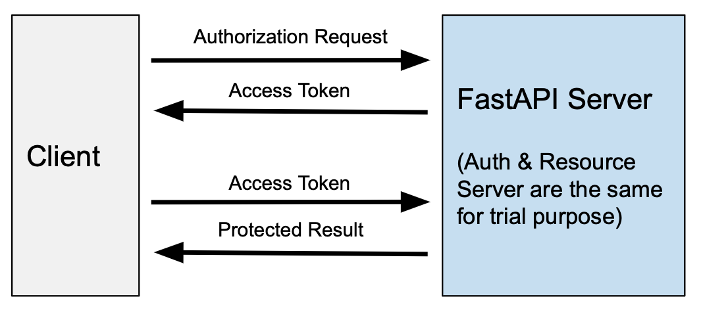

# Serving ML Models Using FastAPI  (Oauth2 and Logging Mechanism are Included)

This project includes serving a machine learning model using FastAPI with Outh2 security.


## Simplified Architecture



## Step 1 - Creating Sqlite User Database in Python&#x20;

We need to create user database to be able to authorize the user when the user request for access token. In this database we will store user-name and user-hashed-password (we will use Bcyrpt encrypted hash of the password)

* [x] Create username and password for the user

| username  | password     |
| --------- | ------------ |
| trialuser | trialpass123 |

* [x] Hash the password using online Bcrypt generator tool. ([https://bcrypt-generator.com](https://bcrypt-generator.com))

| password     | hashed-password                                              |
| ------------ | ------------------------------------------------------------ |
| trialpass123 | $2a$12$O/9CiF4Ul3WdEgDPCaYtt.r/QjA5kZORpZENxNkV4E8HuD/fZEnma |


* [x] Create a user sqlite database and insert username and hashed-password into the database using Python. (sqlitecreator.py)&#x20;

```
import sqlite3

conn = sqlite3.connect('usersdb') 
c = conn.cursor()

c.execute('''
          CREATE TABLE IF NOT EXISTS users
          ([username] TEXT, [full_name] TEXT,
          [email] TEXT, [hashed_password] TEXT, [disabled] BOOL)
          ''')
        
c.execute('''
          INSERT INTO users
                VALUES
                ('trialuser',"Trial User",
                "info@trialuser.com","$2a$12$O/9CiF4Ul3WdEgDPCaYtt.r/QjA5kZORpZENxNkV4E8HuD/fZEnma",
                "False")
          ''')

conn.commit()

print("finished")
```

## Step 2 - Developing the Machine Learning Model

We will train a machine learning model using pima-indians-diabetes data (you can find the details here [https://www.kaggle.com/uciml/pima-indians-diabetes-database](https://www.kaggle.com/uciml/pima-indians-diabetes-database)). If you already have an ML model you can skip this step.

* [x] Open your jupyter notebook.

```
jupyter notebook
```

* [x] Create and dump dummy ML model ([https://machinelearningmastery.com/save-load-machine-learning-models-python-scikit-learn/](https://machinelearningmastery.com/save-load-machine-learning-models-python-scikit-learn/))

```
# Save Model Using Pickle
import pandas
from sklearn import model_selection
from sklearn.linear_model import LogisticRegression
import pickle
url = "https://raw.githubusercontent.com/jbrownlee/Datasets/master/pima-indians-diabetes.data.csv"
names = ['preg', 'plas', 'pres', 'skin', 'test', 'mass', 'pedi', 'age', 'class']
dataframe = pandas.read_csv(url, names=names)
array = dataframe.values
X = array[:,0:8]
Y = array[:,8]
test_size = 0.33
seed = 7
X_train, X_test, Y_train, Y_test = model_selection.train_test_split(X, Y, test_size=test_size, random_state=seed)
# Fit the model on training set
model = LogisticRegression()
model.fit(X_train, Y_train)
# save the model to disk
filename = 'finalized_model.sav'
pickle.dump(model, open(filename, 'wb'))
```

## Step 3 - Developing the API

In this section, API development with security features will be described step by step. You can check fastapi website for detailed information. [https://fastapi.tiangolo.com/tutorial/security/oauth2-jwt/](https://fastapi.tiangolo.com/tutorial/security/oauth2-jwt/)


You can find full version of the code in the files (main.py).


* [x] Install python-jose library to generate and verify JWT tokens

```
pip install "python-jose[cryptography]"
```

* [x] Install passlib library to handle password hashes

```
pip install "passlib[bcrypt]"
```

* [x] Create a random secret key that will be used to sign the JWT tokens

```
openssl rand -hex 32

09d25e094faa6ca2556c818166b7a9563b93f7099f6f0f4caa6cf63b88e8d3e7
```

* [x] Add Secret Key to your python code and describe oauth scheme and cryptographic context.

```
from fastapi.security import OAuth2PasswordBearer, OAuth2PasswordRequestForm
from jose import JWTError, jwt
from passlib.context import CryptContext


#PARAMETERS and DESCRIPTIONS

# to get a string like this run:
# openssl rand -hex 32
SECRET_KEY = "09d25e094faa6ca2556c818166b7a9563b93f7099f6f0f4caa6cf63b88e8d3e7"
ALGORITHM = "HS256"

#Oauth2 
pwd_context = CryptContext(schemes=["bcrypt"], deprecated="auto")
oauth2_scheme = OAuth2PasswordBearer(tokenUrl="token")
```

* [x] Add security management functions

```
def import_users_db():
    conn = sqlite3.connect('usersdbtrial') 
    c = conn.cursor()
    c.execute('''
          SELECT *
          FROM users
          ''')

    df = pd.DataFrame(c.fetchall(),columns=["username","full_name",
          "email","hashed_password",
          "disabled"])
    print (df)
    df.set_index(df["username"],inplace=True)
    result = df.to_json(orient="index")
    users_db = json.loads(result)

    return users_db

def verify_password(plain_password, hashed_password):
    return pwd_context.verify(plain_password, hashed_password)

def get_password_hash(password):
    return pwd_context.hash(password)

def get_user(db, username: str):
    if username in db:
        user_dict = db[username]
        return UserInDB(**user_dict)

def authenticate_user(fake_db, username: str, password: str):
    user = get_user(fake_db, username)
    if not user:
        return False
    if not verify_password(password, user.hashed_password):
        return False
    return user

def create_access_token(data: dict):
    to_encode = data.copy()
    encoded_jwt = jwt.encode(to_encode, SECRET_KEY, algorithm=ALGORITHM)
    return encoded_jwt

async def get_current_user(token: str = Depends(oauth2_scheme)):
    credentials_exception = HTTPException(
        status_code=status.HTTP_401_UNAUTHORIZED,
        detail="Could not validate credentials",
        headers={"WWW-Authenticate": "Bearer"},
    )
    try:
        payload = jwt.decode(token, SECRET_KEY, algorithms=[ALGORITHM])
        username: str = payload.get("sub")
        if username is None:
            raise credentials_exception
        token_data = TokenData(username=username)
    except JWTError:
        raise credentials_exception
    user = get_user(users_db, username=token_data.username)
    if user is None:
        raise credentials_exception
    return user

async def get_current_active_user(current_user: User = Depends(get_current_user)):
    if current_user.disabled:
        raise HTTPException(status_code=400, detail="Inactive user")
    return current_user

```

* [x] Add logging mechanism

```
def log_api_calls(request_data,response_data,request_header):
    now = datetime.now()
    log_data={"date":str(now),"request":str(request_data),"response":str(response_data),"request_header":str(request_header)},
    df_log=pd.DataFrame(log_data)
    df_log.to_csv("log.csv", mode="a", header=False, index=False)

    message="logging succesfull"
    print(message)
```

* [x] Call FastAPI library and create an endpoint to be used to create the session token

```
app = FastAPI()

#Add api limitter to app
app.state.limiter = limiter
app.add_exception_handler(RateLimitExceeded, _rate_limit_exceeded_handler)

#Userdb connection
users_db = import_users_db() 

@app.post("/token", response_model=Token, tags=["create-token"])
async def login_for_access_token(form_data: OAuth2PasswordRequestForm = Depends()):
    user = authenticate_user(users_db, form_data.username, form_data.password)
    if not user:
        raise HTTPException(
            status_code=status.HTTP_401_UNAUTHORIZED,
            detail="Incorrect username or password",
            headers={"WWW-Authenticate": "Bearer"},
        )
    access_token = create_access_token(
        data={"sub": user.username}
    )
    return {"access_token": access_token, "token_type": "bearer"}
```

* [x] Add the regression endpoint for inetacting your machine learning model

```
@app.post("/regression")
def postanitem(inp: list):
    inp = np.array(inp).reshape(1,-1)
    filename = 'finalized_model.sav'
    loaded_model = pickle.load(open(filename, 'rb'))
    out = loaded_model.predict(inp)
    print(float(out))
    o = {'Output':float(out)}
    return o
```

## Step 4 - Testing the API

